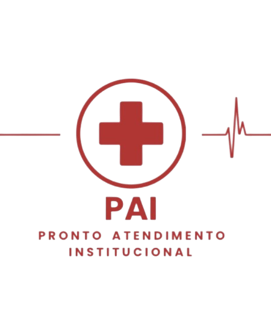

  
  <h1>PAI Online</h1>
Aplicativo web de Prontuário Socorrista para o Pronto Atendimento Institucional da UNIESP.

# :notebook_with_decorative_cover: Conteúdo
- [Sobre o Projeto](#star2-about-the-project)
  * [Screenshots](#camera-screenshots)
  * [Tech Stack](#space_invader-tech-stack)
  * [Features](#dart-features)
  * [Guia de Estilo](#art-color-reference)
- [Inicializando](#toolbox-getting-started)
  * [Pré-requisitos](#bangbang-prerequisites)
  * [Instalação](#gear-installation)
  * [Fazendo Testes](#test_tube-running-tests)
  * [Executar Localmente](#running-run-locally)
  * [Deployment](#triangular_flag_on_post-deployment)
- [Uso](#eyes-usage)
- [Roadmap](#compass-roadmap)
- [Contribuidores](#wave-contributing)
- [FAQ](#grey_question-faq)
- [Licença](#warning-license)
- [Contato](#handshake-contact)
- [Agradecimentos](#gem-acknowledgements)

<!-- About the Project -->
## :star2: Sobre o Projeto

## Introdução
O projeto tem como o objetivo a criação de um aplicativo web para o preenchimento de formulários de atendimento socorrista do PAI (Pronto Atendimento Institucional da UNIESP), visando modernizar e otimizar o processo de atendimento, garantindo maior eficiência, segurança e organização nos registros. Este projeto visa melhorar a qualidade do atendimento, facilitar o acesso às informações e promover uma gestão mais eficaz dos serviços de saúde dentro da universidade.

## Documentação
* [Documentação principal do projeto](https://docs.google.com/document/d/1fyHg4xqPUZPvmofl27iYEhMXS6r9Jg1KQsGO3RyhiXA/edit?usp=sharing)

## Tecnologias utilizadas
* HTML
* CSS
* JavaScript
* React Framework
* Java
* Spring Boot Framework
* Banco de Dados em PostGres  

## Ferramentas utilizadas
* VS Code
* GitHub
* Figma
* Jira

## Funcionalidades
1. Registro de atendimentos socorristas;
2. Consulta ao histórico do paciente;
3. Geração de relatória periódicos de atendimentos.
   

